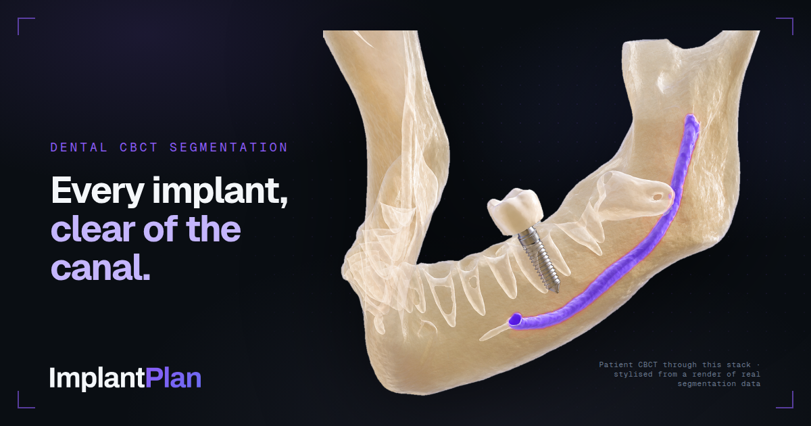
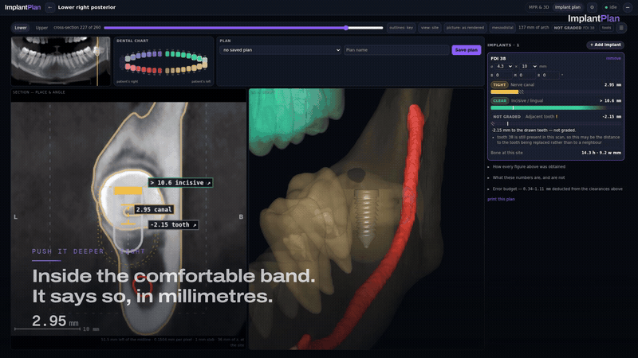
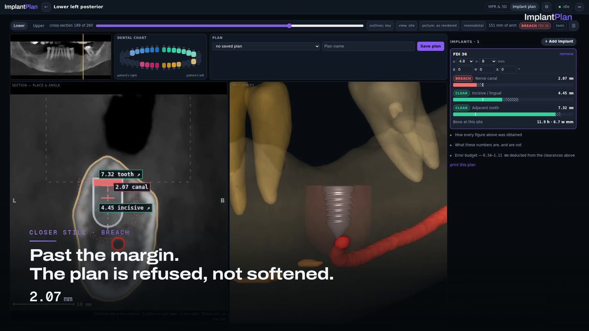
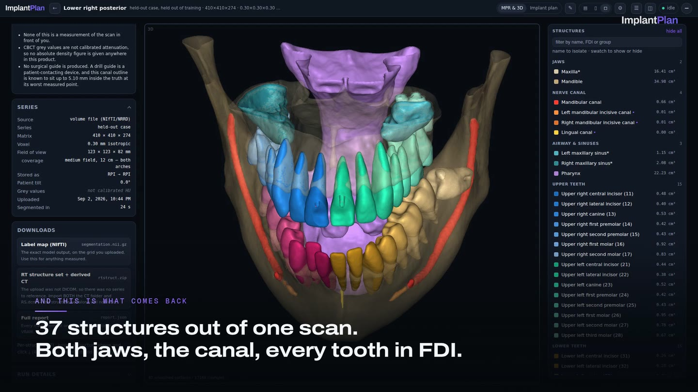

<div align="center">



### Place an implant on a cone-beam CT and get the clearance as a number — with the model's own measured error already subtracted from it.

[**dentistry.dicomsegvr.com**](https://dentistry.dicomsegvr.com) · research preview · **not a medical device, and not for diagnostic use**



</div>

**One site, three depths.** The site is a real gap — a missing lower-left first molar,
with 11.9 mm of bone measured above the canal and 6.7 mm of crestal width. An 8 mm fixture
seated on the crest sits 3.51 mm off the inferior alveolar canal: `CLEAR`. A millimetre
deeper it is `TIGHT` at 2.55. Half a millimetre deeper again it `BREACH`es at 2.07. Back
to the crest and it is clear. Every one of those millimetres has the canal's own boundary
error taken out of it first.

That is the whole product. Every planner draws the nerve. None of them tells you how
wrong the nerve is.

## Watch

<table>
<tr>
<td width="50%"><a href="marketing/video/implantplan-plan.mp4"></a></td>
<td width="50%"><a href="marketing/video/implantplan-pipeline.mp4"></a></td>
</tr>
<tr valign="top">
<td>

**[Implant planning](marketing/video/implantplan-plan.mp4)** · 1:39 — click the gap where
a tooth is missing, seed a fixture, watch it size itself to the bone that is actually
there, and see a plan refused when it should be.

</td>
<td>

**[Scan to structures](marketing/video/implantplan-pipeline.mp4)** · 1:34 — one upload, a
model catalogue you choose from before a byte is sent, about 98 seconds of GPU for the two
models that run, and a report that publishes its own error.

</td>
</tr>
</table>

Vertical cuts, for phones and for social:
plan [9:16](marketing/video/implantplan-plan-9x16.mp4) ·
[4:5](marketing/video/implantplan-plan-4x5.mp4) — pipeline
[9:16](marketing/video/implantplan-pipeline-9x16.mp4) ·
[4:5](marketing/video/implantplan-pipeline-4x5.mp4).
Every cut is committed under [`marketing/video/`](marketing/video/); clicking a poster
opens GitHub's own player on the file.

Both films are recorded from the running app on a real GPU. The verdicts, the clearances
and the scores in them are read back out of the page rather than typed into a script —
see [`marketing/`](marketing/) for how they are made and what they are held to.

## The models are ours

Seven models sit in the catalogue. Two of them we trained ourselves, here, on our own
GPUs.

**The base model** is an nnU-Net with a U-Mamba2 bottleneck. It paints the whole dental
taxonomy — both jaws, every tooth in FDI notation, the mandibular canal, the sinuses, the
airway and the nerve canals — in one pass, in about 95 seconds on one GPU.

> Strict Dice **0.8292**, HD95 **1.235 mm**, NSD **0.9736**, challenge Dice **0.8965**,
> over a 20-case holdout it never saw. That is above the published SegResNet entry (0.87)
> and within 0.012 of the challenge winners (0.908).

**The anterior canal specialist** is a second network trained on the anterior mandible
alone, because the inferior alveolar canal ends at the mental foramen and an anterior
implant has three other canals to clear. It gains **+0.0505 / +0.0874 / +0.0172** Dice on
the left incisive, right incisive and lingual canals, pulls their predicted volume from
155–205% of ground truth down to **99–111%**, and beats the base model on 40 external
PMCanalSeg cases at **p = 7.6 × 10⁻⁴**.

The other five are third-party and are labelled as such in the picker, with what each one
is measured to do and whether it is installed at all.

## Why a number beats a picture

On the 20-case holdout the inferior alveolar canal's boundary sits up to **0.46 mm inside
the truth at the 95th percentile** — worst single voxel 5.10 mm. The incisive and lingual
canals are 2–3× worse. So a raw distance to a drawn nerve is optimistic by an amount
nobody quotes.

Here every clearance is graded as `measured − that structure's own inward p95` against the
margin, per structure. A measurement that carries a caveat is **refused a verdict** rather
than given a hopeful one, and *not graded* outranks *tight*: "we could not grade this"
must never be able to read as "clear".

The solid being measured is a capsule of the stated diameter and length. The 3-D view
draws a threaded screw **strictly inside** it — every drawn vertex inside the measured
envelope to 4e-6 mm, the thread crest touching it to 2e-8 mm, both asserted in tests. The
picture can only ever occupy less space than the number.

## What you can do

**Place an implant and get graded distances.** Buccolingual and mesiodistal angulation
plus clocking, each drawn in the plane it is visible in — the cross-section draws the
buccolingual angle at true angle and the mesiodistal one foreshortened by exactly
`cos(yaw)`, which is exact rather than approximate because the orthogonal projection of a
capsule is a capsule. The panoramic is the other way round. Clocking is carried, drawn,
and stated to change no measurement, because the measured solid is a body of revolution.

**Seed as a restoration, then fit to the measurement.** It is seated **between the
cortical plates**, not on the arch curve. The curve is fitted to crowns and interpolated
across gaps, so at exactly the edentulous sites an implant goes it can sit to one side of
the ridge underneath — and seating on it put a fixture's buccal wall against the outer
cortex. `ridge.py` reports where the plates are and the platform is centred between them.

The diameter comes from the tooth the site replaces — 3.3 mm at a lateral incisor, 4.8 mm
at a first molar — narrowed if the measured ridge cannot take it. The length starts at the 10 mm a planner reaches for and
caps at 13 mm however much bone there is. Deliberately not "the largest fixture that
fits", which is what the seeding used to compute and no clinician would plan.

Then the seed closes against the server's own answer: measure, and if the canal clearance
is not clear, step down one catalogue length and measure again, up to three times. The
card says which happened — *shortened 2 sizes — the longest length that measures clear of
the canal here* — or admits that no catalogue length did. Any deliberate edit ends the
loop, so it can never fight the person using it.

**Correct the mask, and every number is recomputed from the correction.** Labelmap tools
in the right dock; on apply the worker rebuilds the distance fields, meshes, outlines,
structure set and per-site bone heights. What it does *not* rebuild is stated rather than
assumed: the arch curve and the section list are frozen so a saved plan's coordinates keep
meaning the same place.

And because the mask a browser can edit is the downsampled display copy, an edited
contour's error budget is **widened by half a display voxel** — and the dock states that
arithmetic *before the stroke*: `0.46 mm model + 0.30 mm grid = 0.76 mm deducted from
every clearance measured against it`. A correction is a decision. A hand-drawn contour is
not automatically a more accurate one.

**Choose which models run on your upload.** A base model paints the taxonomy and
specialists overwrite only the ids they own, with every voxel outside a specialist's
region asserted byte-identical to the base prediction on every case. Availability is
reported by the worker, never guessed, and a request for a model this deployment does not
have is **refused before the upload is written** rather than quietly downgraded.

**Take it away in a format your software reads.** Label map, RTSTRUCT, per-structure STL,
and the plan as a printed sheet.

## The anatomy beyond the teeth, and why it ships off

The taxonomy has room for **89** structures: the 47 dental ones, plus 42 in a second id
space — muscles of mastication, tongue, pharyngeal divisions, nasal cavities, palate,
salivary glands, orbit, neck cartilages, great vessels — drawn by three Apache-2.0
TotalSegmentator head/neck models.

**All three ship `off`, because they were measured and they do not transfer.** They are
trained on CT in Hounsfield units; cone-beam CT has neither calibrated Hounsfield units
nor usable soft-tissue contrast. Across three holdout cases and 126 structure
opportunities, **one** survived the plausibility gate: the tongue came out at 1.76 cm³
against an anatomical 70–100, one masseter was found and the other was not inside a field
of view containing both, and the oropharynx arrived in 155 connected pieces.

What ships is the machinery, and it is worth having on its own — a **second composition
space that cannot reach the first** (the extended pass paints only where the merged label
is 0, so switching a soft-tissue model on is structurally incapable of moving a clearance
or a verdict); a **per-case transfer probe** that passes at 0.85 and 0.82 and catches a
total failure at 0.12; and a **per-structure plausibility gate** on volume, connectedness
and symmetry, which caught the failure the probe missed and tells "cut by a 123 mm field
of view" apart from "present, in frame, and wrong". See
[`eval/extended.md`](eval/extended.md) — the threshold was committed before the numbers
were measured.

## Layout

| | |
|---|---|
| `api/` | FastAPI. Jobs, files, plans, measurement. Deliberately **numpy-free** — a subprocess test asserts it. |
| `worker/` | The GPU pipeline, a host systemd unit rather than a pod. Segmentation, the extended pass, meshes, RTSTRUCT, panoramic + cross-sections, the measurement pack. |
| `dentistry/` | The domain: label taxonomy, extended space, arch fitting, ridge measurement, implant geometry, clearance metrics, the safety grader. |
| `web/` | The app. Vanilla JS, no build step. |
| `viewer/` | Cornerstone3D + vtk.js, bundled by esbuild into `web/viewer.js`. |
| `web-auth/` | OIDC bundle, and the two headless gates. |
| `marketing/` | The films, stills and brand assets this README embeds. |
| `tests/`, `scripts/`, `eval/` | Phantom tests, generators, and the evaluation write-ups. |

The viewer is three panes: a rail of findings and provenance, the MPR/3-D stage, and a
right dock holding the contouring tools and the structure list. There is no separate slice
tab — the MPR panes show the same three planes from the same volume and cross-reference
each other.

The dock belongs to the MPR tab alone. Switching to implant planning takes it away
entirely, along with the button that opens it: there is no mask editing on that tab, and a
toolbar that cannot write is worse than no toolbar. The plan tab narrows the 3-D pane to
the anatomy the implant is graded against — canals, sinuses, the working jaw, the teeth
within 24 mm of the site and any restorations among them — and shows the whole case when
no implant is selected.

In the structure list a click isolates one structure and takes every pane to it;
⌘/Ctrl-click adds to the isolate rather than replacing it, so a canal and the two teeth
either side of a site can be up together.

## Gates

Nothing here is asserted by comment if it can be asserted by a check.

```bash
./venv/bin/python -m pytest tests/test_phantom.py -q   # geometry and safety, numpy-free API included
node web-auth/check-app.js                             # static wiring, palettes, CSS contracts
node web-auth/check-rail.mjs                           # 156 rendered states in real Chrome, 640-3440px
node web-auth/check-rail.mjs --prove                   # every assertion proven to fail when broken
node web-auth/check-rail.mjs --selftest                # the JS coordinate map against Python's vectors
node viewer/check-bundle.mjs                           # the bundle kept every behaviour it had
node viewer/check-equivalence.mjs                      # browser vs Python geometry, on a real GPU
scripts/make_preview_gif.sh                            # the README's GIF shows the three verdicts it claims
```

`--prove` is the one worth knowing about: an assertion that cannot be shown to fail is
treated as a bug, because this repo has shipped vacuous ones before. It currently proves
12 of 12 — and not all twelve breaks are fixture edits. The multi-structure isolate is
guarded by a break that reverts the app to single-select at runtime, because no amount of
mutated JSON can exercise a defect that lives in a click handler.

Some things only fail while a volume is mounted, which the fixture harness never does.
`scripts/isolate_probe.mjs` is the pattern for those: it drives the real case in headless
Chrome on the real GPU and reads the answer back out of the viewer rather than off the
screen.

## What is not in this repository

- **Model weights** (~2.8 GB). The base model is fine-tuned from
  [ToothFairy3](https://toothfairy3.grand-challenge.org/), which is **CC BY-NC-SA 4.0**,
  so anything derived from it is research and non-commercial use only. The three head/neck
  models are Apache-2.0 and are fetched by `scripts/prepare_models.py`.
- **Patient volumes and job results.**
- **Evaluation dumps** (~1 GB of per-case `.npy`). The metrics and the write-ups that cite
  them are committed.
- **Harness fixtures derived from a CBCT** — two JPEGs and their manifests. Regenerate
  with `scripts/make_web_fixtures.py <results-dir>`; without them `check-rail.mjs` cannot
  render a section.
- **Secrets.** `.worker.env` is git-ignored; the k8s manifests reference a cluster Secret
  by name and carry no values.
- **The documentation tour.** `scripts/record_tour.sh` regenerates it in three commands.
  The cut is not committed for the same reason the fixtures are not.

## Contact

**Gustavo Formento** — the author of this service.

- Email: <gustavo.formento@rtmedical.com.br>
- LinkedIn: [linkedin.com/in/gustavoogomesss](https://www.linkedin.com/in/gustavoogomesss/)
- GitHub: [github.com/gomesgustavoo](https://github.com/gomesgustavoo)

Open an issue for bugs; email for custom model work.

## Licensing

No licence is granted on this code yet — all rights reserved until one is chosen.

Separately: the segmentation weights derive from ToothFairy3 (**CC BY-NC-SA 4.0**), and
the running service says so in its own footer. That constrains the *model*, not this
source. The three head/neck models are Apache-2.0 (wasserth/TotalSegmentator) and carry no
such restriction. The films in `marketing/` are recordings of a held-out ToothFairy3 case;
their end cards carry the credit.
